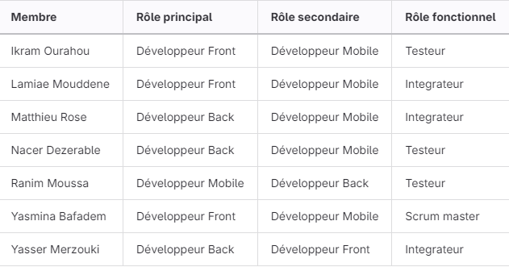

---

title: Présentation projet Master2 grp5

---

<!-- .slide: data-background-image="./image17.png" data-background-size="100%" -->

# Présentation Projet JEE/Mobilité
## projet APE

 
 

Groupe 5 

---

<!-- .slide: data-background-image="./image15.jpg" data-background-size="100%" -->

# Organisation du projet

 <!-- .element style="border: 0; background: None; box-shadow: None" width="100px" -->

----

## Répartition des rôles

----

## Communication

----

## gestion de projet

---

<!-- .slide: data-background="./image8.jpg" -->

# Choix techniques
 <!-- .element style="border: 0; background: None; box-shadow: None" width="100px" -->

----

<!-- .slide: data-background="./image5.jpg" -->

## Back

----

<!-- .slide: data-background="./image6.jpg" -->

## Front

----

<!-- .slide: data-background="./image7.jpg" -->

## Mobile

---

# Difficultés rencontrées

----

## Coté métier 
- Complexité des fonctionnalités <!-- .element: class="fragment" data-fragment-index="1" -->
- Limitation de temps <!-- .element: class="fragment" data-fragment-index="2" -->

----

## Coté technique
- Difficultés à faire le développement mobile <!-- .element: class="fragment" data-fragment-index="1" -->
- Découverte d'Angular pour certains <!-- .element: class="fragment" data-fragment-index="2" -->
- Utilisation de l'API google <!-- .element: class="fragment" data-fragment-index="3" -->

---

<!-- .slide: data-background-image="./image14.png"-->

